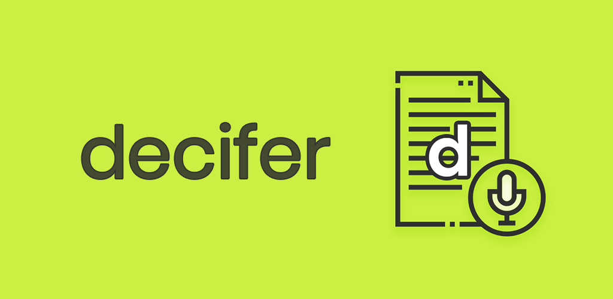
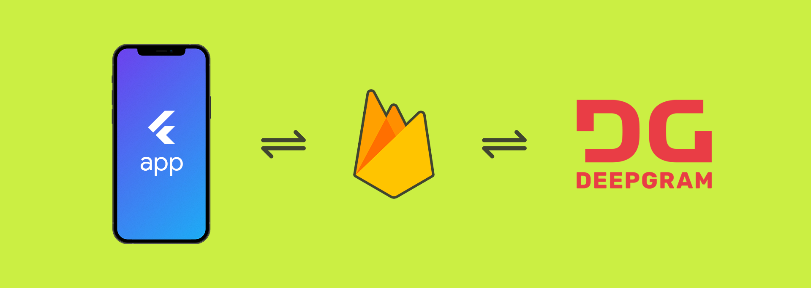

# Decifer

A cross-platform mobile app that helps you to generate transcripts either from a voice recording or by uploading an audio file. The project uses a totally serverless architecture.

## Architecture

The mobile app is created using [Flutter](https://flutter.dev/) which is integrated with [Firebase](https://firebase.google.com/). Firebase **Cloud Functions** is used to deploy the backend code required for communicating with the Deepgram API.

## App overview

The Flutter application consists of the following pages/screens:

* Login Page
* Register Page
* Dashboard Page
* Record Page
* Upload Page
* Transcription Page

For authenticating the user inside the app -- **Login** and **Register** pages are used. Authentication is required to generate unique accounts for users required for storing the generated transcripts to [Firestore](https://firebase.google.com/docs/firestore) and facilitate **cloud-sync**.

 
The **Dashboard Page** displays a list of all the transcripts currently present on the user's account. It also has two buttons - one for navigating to the Record Page and the other for navigating to the Upload Page.

 

**Record Page** lets you record your audio using the device microphone and the transcribe it using Deepgram. You always have an option to re-record if you think the last recording wasn't good.

 

From the **Upload Page**, you can choose any audio file present on your device and generate the transcript of it.

 

**Transcription Page** is where the entire transcript can be viewed. It has an audio-transcript synchronized playback that highlights the text transcript part with respect to the audio that is playing.

  
 
You can also see the **confidence map** of each of the parts of the transcript (it shows how much accurate is that part of transcript generation - _darker is higher confidence_).

You can also easily print or share the generated transcript in the **PDF** format.

<!-- > Try out on Android: https://appdistribution.firebase.dev/i/a57e37b2fda28351 -->

## License

Copyright 2022 Souvik Biswas

Licensed under the Apache License, Version 2.0 (the "License");
you may not use this file except in compliance with the License.
You may obtain a copy of the License at

    http://www.apache.org/licenses/LICENSE-2.0

Unless required by applicable law or agreed to in writing, software
distributed under the License is distributed on an "AS IS" BASIS,
WITHOUT WARRANTIES OR CONDITIONS OF ANY KIND, either express or implied.
See the License for the specific language governing permissions and
limitations under the License.